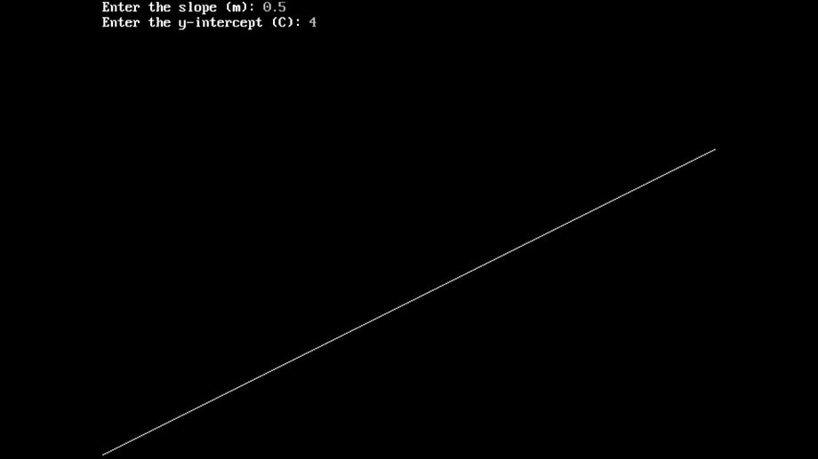
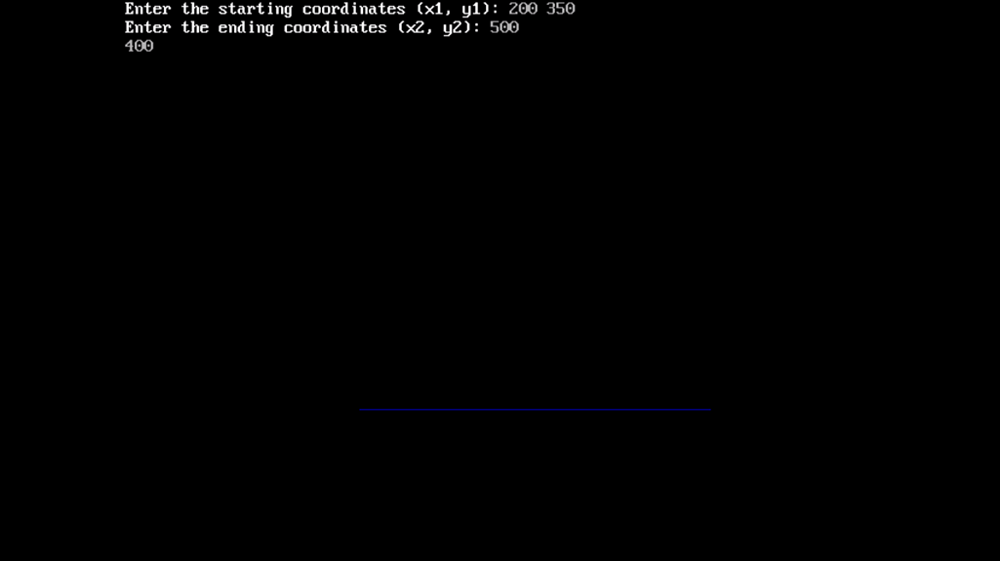
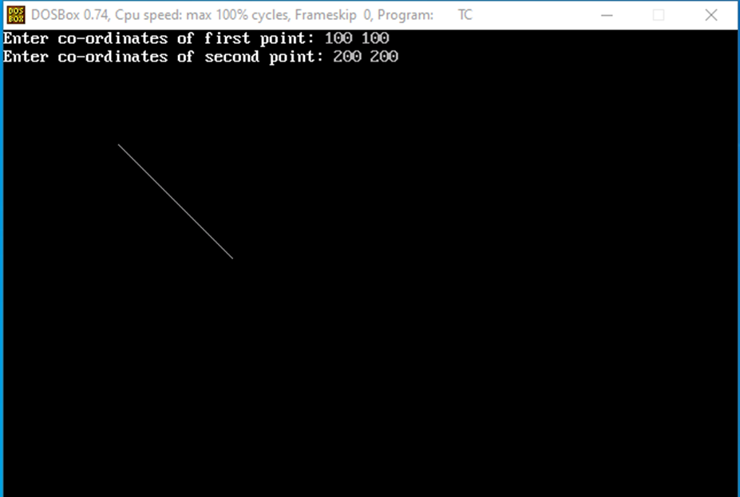
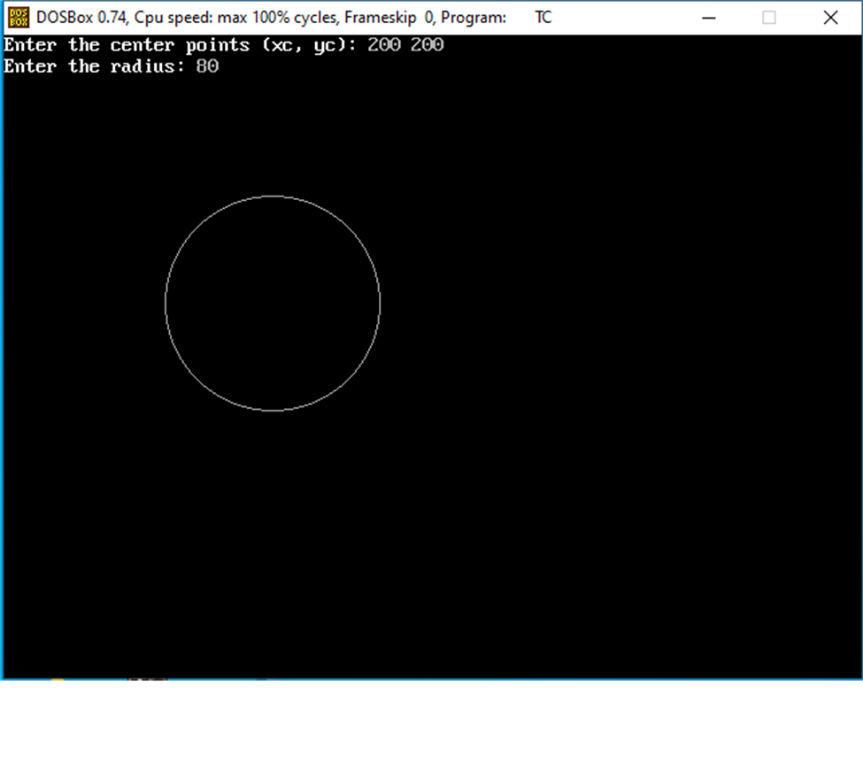
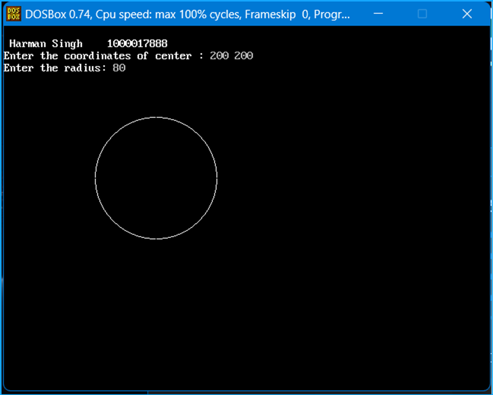
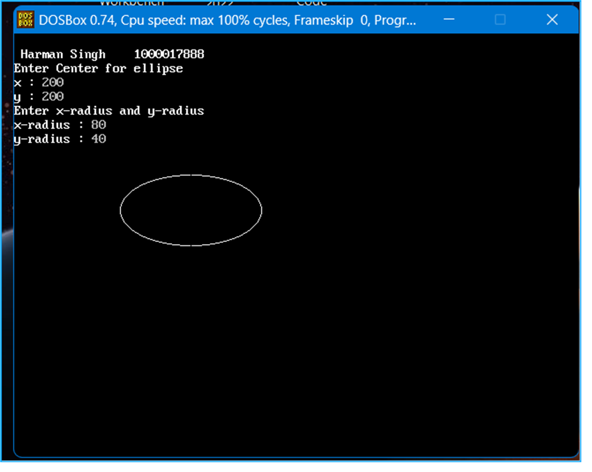
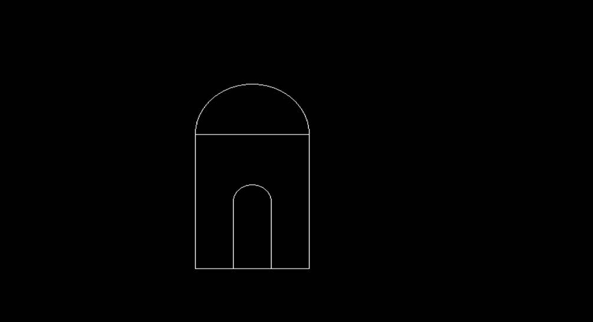
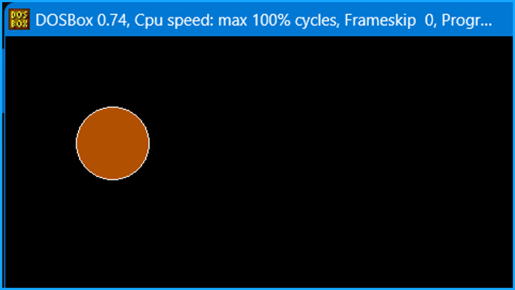
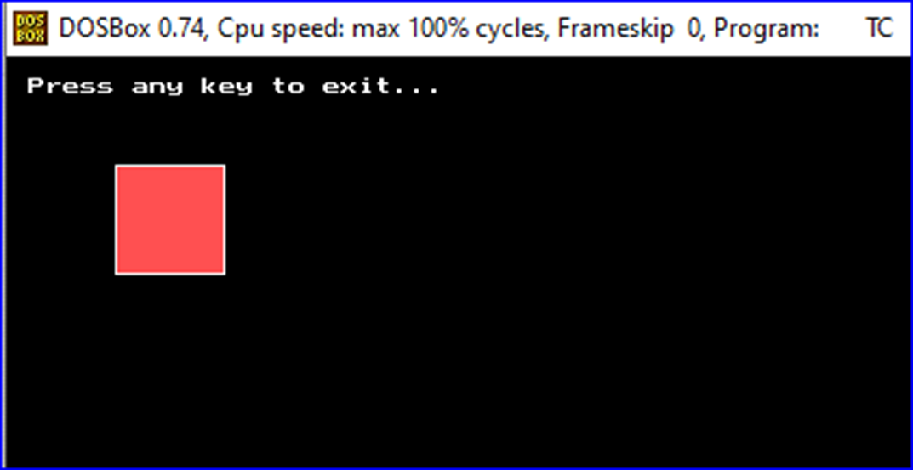

# Computer Graphics Using C

A comprehensive collection of computer graphics programs implemented in C. This repository contains various algorithms such as line, circle, and ellipse drawing (DDA, Bresenham, Midpoint) and polygon filling techniques (Boundary Fill, Flood Fill), along with sample outputs for visualization. Ideal for students and enthusiasts learning graphics programming.

---

## Table of Contents

1. [Introduction](#introduction)
2. [Programs Included](#programs-included)
   - [Line Drawing using Y = mX + C](#1-line-drawing-using-y--mx--c)
   - [Line Drawing using DDA Algorithm](#2-line-drawing-using-dda-algorithm)
   - [Line Drawing using Bresenham’s Algorithm](#3-line-drawing-using-bresenham’s-algorithm)
   - [Circle Drawing using Midpoint Circle Algorithm](#4-circle-drawing-using-midpoint-circle-algorithm)
   - [Circle Drawing using Bresenham’s Algorithm](#5-circle-drawing-using-bresenham’s-algorithm)
   - [Ellipse Drawing using Midpoint Ellipse Algorithm](#6-ellipse-drawing-using-midpoint-ellipse-algorithm)
   - [Hut Drawing in Computer Graphics](#7-hut-drawing-in-computer-graphics)
   - [Polygon Filling using Boundary Fill Algorithm](#8-polygon-filling-using-boundary-fill-algorithm)
   - [Polygon Filling using Flood Fill Algorithm](#9-polygon-filling-using-flood-fill-algorithm)
3. [How to Compile and Run](#how-to-compile-and-run)
4. [Screenshots](#screenshots)
5. [License](#license)

---

## Introduction

This repository is a curated collection of fundamental computer graphics programs written in C. Each program demonstrates a specific algorithm for rendering graphics on a screen, ranging from basic line drawing to complex polygon filling. The repository also includes screenshots of outputs to help visualize the results.

---

## Programs Included

### 1. Line Drawing using Y = mX + C

- **Code**: [y_mx_c_line.c](programs/y_mx_c_line.c)
- **Description**: Draws a straight line based on the equation `Y = mX + C`.
- **Screenshot**:
  

### 2. Line Drawing using DDA Algorithm

- **Code**: [dda_line.c](programs/dda_line.c)
- **Description**: Implements the Digital Differential Analyzer (DDA) algorithm for line drawing.
- **Screenshot**:
  

### 3. Line Drawing using Bresenham’s Algorithm

- **Code**: [bresenham_line.c](programs/bresenham_line.c)
- **Description**: Implements Bresenham's line drawing algorithm for efficient rendering of straight lines.
- **Screenshot**:
  

### 4. Circle Drawing using Midpoint Circle Algorithm

- **Code**: [midpoint_circle.c](programs/midpoint_circle.c)
- **Description**: Draws a circle using the Midpoint Circle algorithm.
- **Screenshot**:
  

### 5. Circle Drawing using Bresenham’s Algorithm

- **Code**: [bresenham_circle.c](programs/bresenham_circle.c)
- **Description**: Implements Bresenham's algorithm to draw a circle.
- **Screenshot**:
  

### 6. Ellipse Drawing using Midpoint Ellipse Algorithm

- **Code**: [midpoint_ellipse.c](programs/midpoint_ellipse.c)
- **Description**: Draws an ellipse using the Midpoint Ellipse algorithm.
- **Screenshot**:
  

### 7. Hut Drawing in Computer Graphics

- **Code**: [hut_drawing.c](programs/hut_drawing.c)
- **Description**: Draws a simple hut-like structure using graphics primitives.
- **Screenshot**:
  

### 8. Polygon Filling using Boundary Fill Algorithm

- **Code**: [boundary_fill.c](programs/boundary_fill.c)
- **Description**: Fills a polygon region using the Boundary Fill algorithm.
- **Screenshot**:
  

### 9. Polygon Filling using Flood Fill Algorithm

- **Code**: [flood_fill.c](programs/flood_fill.c)
- **Description**: Fills a polygon region using the Flood Fill algorithm.
- **Screenshot**:
  

---

## How to Compile and Run

1. Install a C compiler such as GCC and ensure the graphics library (e.g., `graphics.h`) is set up.
2. Compile a program using:
   ```bash
   gcc -o output_program programs/program_name.c -lgraph
   ```
3. Run the program using:
   ```bash
   ./output_program
   ```

---

## Screenshots

Below are sample outputs of the programs:

### Midpoint Ellipse Drawing


### Boundary Fill Algorithm


### Flood Fill Algorithm


---

## License

This repository is licensed under the [MIT License](LICENSE). You are free to use, modify, and distribute the code with proper attribution.

---

Feel free to fork, star, or contribute to this repository! For any issues or suggestions, please open an issue in the repository.
